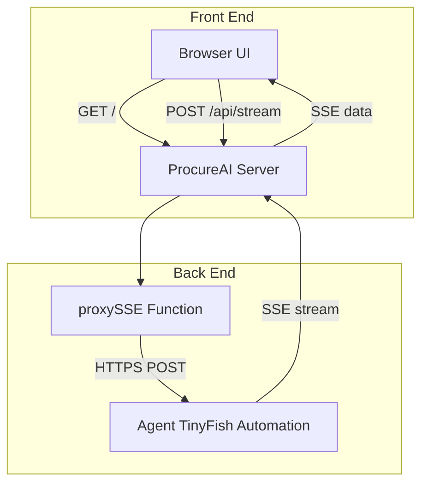
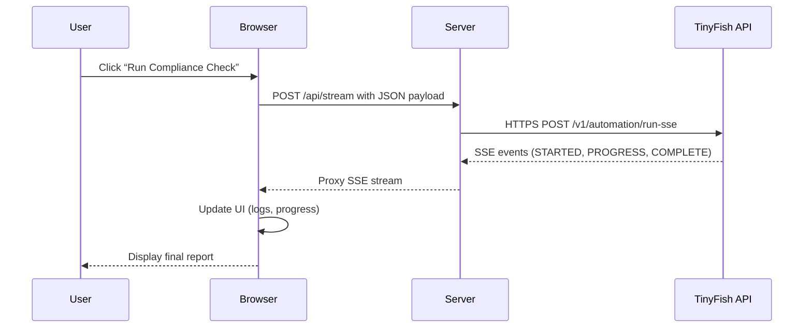

[serverjs-packagejson-indexhtml.md](https://github.com/user-attachments/files/26265001/serverjs-packagejson-indexhtml.md)
# ProcureAI Application Feature Documentation

## Overview

ProcureAI offers an autonomous vendor compliance check tool.  
It combines a Node.js backend with a rich browser UI.  
Users enter a product (and optional vendor) to run five compliance agents.  
Live progress streams back to the browser, then a detailed report displays.

## Architecture Overview



## Component Structure

### 1. Server Layer

#### **server.js** (server.js)

- **Purpose:**  
  - Hosts the front-end HTML and proxies SSE to TinyFish API.  
- **Key Functions:**  
  - `readBody(req)`: Reads request body into a string.  
  - `cors(res)`: Sets CORS headers for all responses.  
  - `send(res, code, obj)`: Sends JSON with CORS and status code.  
  - `proxySSE(clientRes, apiKey, body)`: Proxies SSE from TinyFish to client.  
- **Routing Logic:**  
  - `OPTIONS *`: Handles CORS preflight (204).  
  - `GET /`: Serves `index.html`.  
  - `POST /api/stream`: Starts SSE proxy for agent run.  
  - Fallback: Returns 404 JSON for others.

[!NOTE]  
All JSON endpoints include `Access-Control-Allow-Origin: *`.

[!IMPORTANT]  
The SSE proxy enforces a 10-minute timeout to abort stalled streams.

### 2. Client Layer

#### **index.html** (index.html)

- **Purpose:**  
  - Provides the user interface for input, live pipeline, and report.  
- **UI Structure:**  
  - **Input Card:** Product, vendor (optional), country selector.  
  - **Live Pipeline:** Step cards with logs, live streaming iframe.  
  - **Compliance Report:** Verdict badge, summary, KPI, vendor cards, flags, renewals, raw JSON.  
- **Key Scripts & Methods:**  
  - `start()`: Gathers input and orchestrates all agents.  
  - `runStep()`: Executes one TinyFish agent via SSE.  
  - `runBatch()`: Runs multiple agents in parallel batches of two.  
  - `buildReport()`: Compiles agent outputs into a report object.  
  - `renderReport()`: Updates the DOM with final report data.  

### 3. Configuration

#### **package.json** (package.json)

| Field       | Value                         |
|-------------|-------------------------------|
| **name**    | `procureai`                   |
| **version** | `5.0.0`                       |
| **description** | `Autonomous Vendor Compliance Agent — TinyFish Hackathon` |
| **main**    | `server.js`                   |
| **scripts** | `start: node server.js`       |
| **engines** | `node >=14`                   |

## Data Models

#### RequestModel `[badge:required]`

| Property | Type   | Description                                       |
|----------|--------|---------------------------------------------------|
| `apiKey` | string | **Required.** TinyFish API key for authentication.|
| `url`    | string | **Required.** Agent start URL (e.g. DuckDuckGo).  |
| `goal`   | string | **Required.** Instructions guiding the agent.     |
| `profile`| string | *Optional.* Browser profile (`stealth` or `lite`).|

#### ErrorResponseModel `[badge:read-only]`

| Property | Type   | Description           |
|----------|--------|-----------------------|
| `error`  | string | Error message details.|

#### SSEEventModel `[badge:beta]`

| Property      | Type    | Description                                                                 |
|---------------|---------|-----------------------------------------------------------------------------|
| `type`        | string  | Event type (`STARTED`, `STREAMING_URL`, `PROGRESS`, `HEARTBEAT`, `COMPLETE`).|
| `run_id`      | string  | Unique run identifier (on `STARTED`).                                       |
| `streaming_url`| string | Live browser session URL (on `STREAMING_URL`).                              |
| `purpose`     | string  | Agent's current action description (on `PROGRESS`).                          |
| `message`     | string  | Detailed progress message (on `PROGRESS`).                                  |
| `status`      | string  | Final status (`COMPLETED` or error) (on `COMPLETE`).                        |
| `result`      | object  | JSON payload with agent results (on `COMPLETE`).                            |
| `error`       | object  | Error details when run fails.                                               |

## API Integration

### Fetch Home Page (GET /)

```api
{
  "title": "Fetch Home Page",
  "description": "Retrieve the main application HTML page.",
  "method": "GET",
  "baseUrl": "http://localhost:3000",
  "endpoint": "/",
  "headers": [],
  "queryParams": [],
  "pathParams": [],
  "bodyType": "none",
  "requestBody": "",
  "responses": {
    "200": {
      "description": "HTML page content",
      "body": "<!DOCTYPE html>..."
    },
    "404": {
      "description": "index.html not found",
      "body": "{\"error\":\"index.html not found\"}"
    }
  }
}
```

### CORS Preflight (OPTIONS /*)

```api
{
  "title": "CORS Preflight",
  "description": "Handle CORS preflight requests.",
  "method": "OPTIONS",
  "baseUrl": "http://localhost:3000",
  "endpoint": "/*",
  "headers": [
    {
      "key": "Access-Control-Request-Method",
      "value": "GET,POST,OPTIONS",
      "required": false
    }
  ],
  "queryParams": [],
  "pathParams": [],
  "bodyType": "none",
  "requestBody": "",
  "responses": {
    "204": {
      "description": "No Content",
      "body": ""
    }
  }
}
```

### Proxy SSE to TinyFish Automation (POST /api/stream)

```api
{
  "title": "Proxy SSE to TinyFish Automation",
  "description": "Start an agent run via SSE and stream events to the client.",
  "method": "POST",
  "baseUrl": "http://localhost:3000",
  "endpoint": "/api/stream",
  "headers": [
    {
      "key": "Content-Type",
      "value": "application/json",
      "required": true
    }
  ],
  "pathParams": [],
  "queryParams": [],
  "bodyType": "json",
  "requestBody": "{\n  \"apiKey\": \"sk-tinyfish-xxxx\",\n  \"url\": \"https://duckduckgo.com/?q=Example\",\n  \"goal\": \"Agent instructions...\",\n  \"profile\": \"stealth\"\n}",
  "responses": {
    "200": {
      "description": "SSE data stream of agent events",
      "body": "data: {\"type\":\"STARTED\",\"run_id\":\"...\"}\\n\\ndata: {...}\\n\\n"
    },
    "400": {
      "description": "Bad Request or JSON parse error",
      "body": "{\"error\":\"bad json\"} or {\"error\":\"missing fields\"}"
    },
    "404": {
      "description": "Endpoint not found",
      "body": "{\"error\":\"not found\"}"
    }
  }
}
```

## Feature Flows

### Vendor Compliance Check Flow



## State Management

- **S**: Global front-end state object.  
  - `product`: User-entered product.  
  - `vendor`: User vendor or discovered supplier.  
  - `country`: Selected country.  
  - `key`: TinyFish API key.  
  - `runId`: Local run identifier.  
  - `logs`: Step logs by ID.  
  - `data`: Agent outputs by step.  
  - `report`: Final aggregated report.  
  - `runIds`: TinyFish run IDs per step.  
  - `selectedVendors`: Vendors queued for multi-compliance.  
  - `multiResults`: Multi-vendor compliance results.  
  - `benchData`: Price benchmarking results.

## Integration Points

- **TinyFish Automation API** at `agent.tinyfish.ai/v1/automation/run-sse`  
- **Google Fonts** for typography  
- **html2canvas** for DOM snapshots  
- **jsPDF** for PDF report generation  

## Key Functions Reference

| Function       | Location    | Responsibility                                     |
|----------------|-------------|-----------------------------------------------------|
| `readBody`     | server.js   | Read and resolve HTTP request body.                 |
| `cors`         | server.js   | Apply CORS headers to responses.                    |
| `proxySSE`     | server.js   | Proxy SSE from TinyFish agent to client.            |
| `start`        | index.html  | Initialize UI and orchestrate agent runs.           |
| `runStep`      | index.html  | Execute one TinyFish agent run via SSE.             |
| `runBatch`     | index.html  | Run multiple agent steps in parallel batches.       |
| `buildReport`  | index.html  | Compile agent data into a summary report object.    |
| `renderReport` | index.html  | Render compliance report elements in the DOM.       |

## Error Handling

- Server uses `try/catch` when parsing JSON.  
- Invalid JSON or missing fields yield `400` responses.  
- Unknown routes return `404` JSON with `{"error":"not found"}`.  
- Server logs `EADDRINUSE` and suggests changing `PORT`.  
- Client captures fetch and stream errors in `runStep` and updates UI logs.

## Dependencies

- **Node.js built-ins:** `http`, `https`, `fs`, `path`  
- **NPM packages:** _none_ (no external modules installed)  
- **CDN Scripts:**  
  - `jspdf@2.5.1`  
  - `html2canvas@1.4.1`
